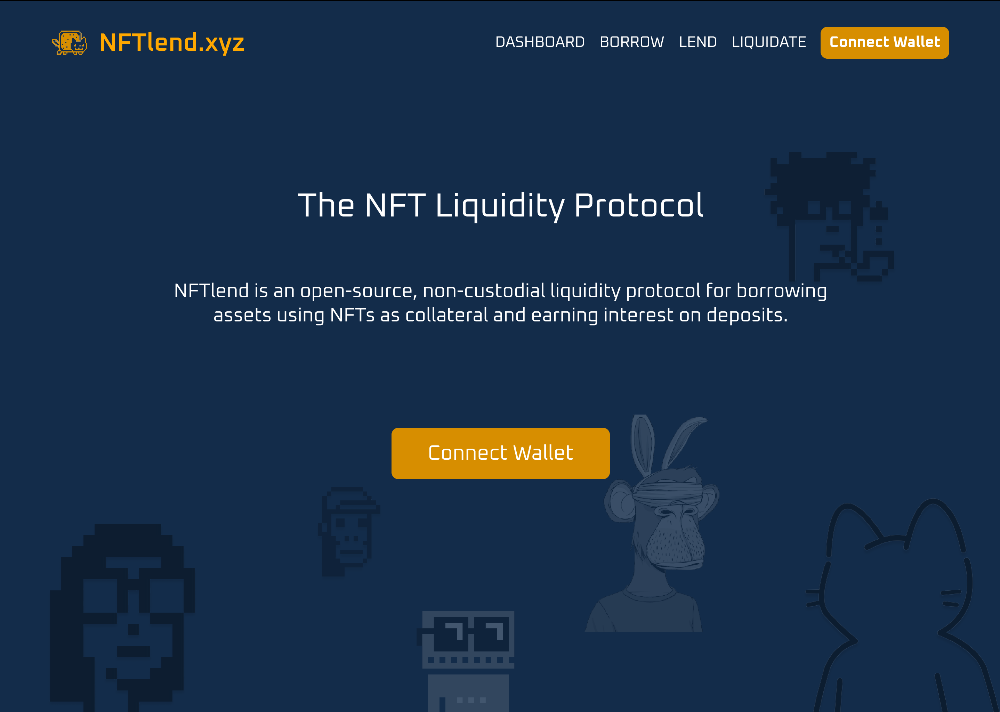

# NFTlend.xyz

The end of searching for liquidity. 

## Design statement

How might we improve liquidity for NFT owners, so that they have immediate access to funds without having to first find a lender, agree to a deal, or sell below market?

## Overview

NFTlend is building the first automated market maker for instant, permissionless NFT-backed loans.

- **Borrowers** escrow NFTs to instantly access over-collateralized, fixed-term loans priced at the project floor. 

- **Lenders** deposit assets into the lending pool to receive yield generated from borrower interest payments. 

- **Liquidators** repay any loan defaults (those expired or undercollateralized) to purchase the underlying NFT at a discount.

## Video demo

## System diagram

- **Lending Pool** is the main contract of the protocol exposing all user interaction endpoints; `deposit`, `withdraw`, `borrow`, `repay` and `liquidate`.

- **Collateral Manager** contract handles the escrow of NFTs and loan creation.

- **nTokens** are interest-bearing derivative tokens that are minted and burned upon the `deposit` and `withdraw` of asset tokens to / from the `Lending Pool` at a 1:1 ratio.

- **debtTokens** are non-transferable derivative tokens that are minted and burned upon the `borrow` and `repay` of loans to the `Lending Pool` a 1:1 ratio with the asset token repayment amount. It is the ratio of `debtTokens` to `nTokens`, updated at every user interaction, that is used to calculate the interest generated by the protocol.

- **NFT Pricing Oracles** are used to update NFT project floor prices, to price new loans and signal if the underlying loan collateral price falls below threshold for liquidation.

- **Token Pricing Oracles** are used to calculate exchange rates from the `NFT Pricing Oracles`, priced in ETH, to other loaned assets; DAI and USDC.

- **Libraries** contain reusable code, refactored from the protocol to save gas.

- **Configurator** is the admin contract used to set / update protocol variables. 

## User Interface

### Landing page

### Dashboard

### Borrow

### Lend

### Liquidate

### Asset

## Instructions

### Protocol

1. Follow the instructions as per [v1-core/README.md](v1-core/README.md).
1. Make note of the smart contract addressed logged to console.

### User Interface

1. Follow the instructions as per [interface/README.md](interface/README.md).
1. Copy the smart contract addresses from the protocol and copy these over to [interface/hooks/](interface/hooks/).

## Licensing

The primary license for NFTlend V1 Core is the Business Source License 1.1 (`BUSL-1.1`), see [`LICENSE`](./LICENSE)